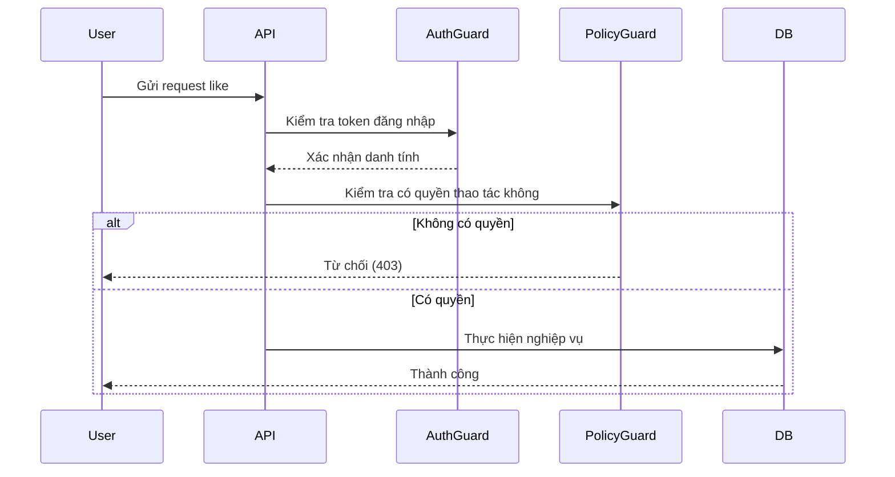
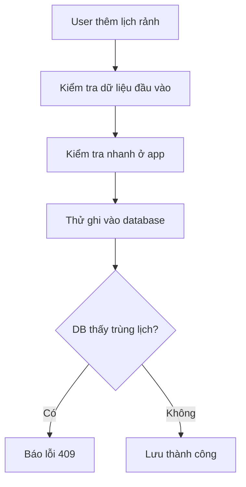
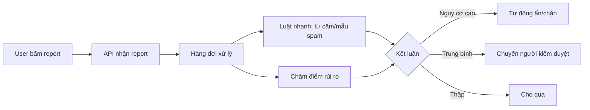
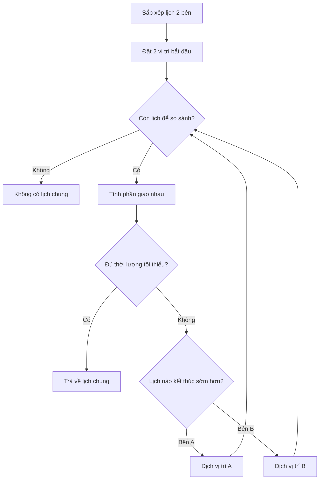
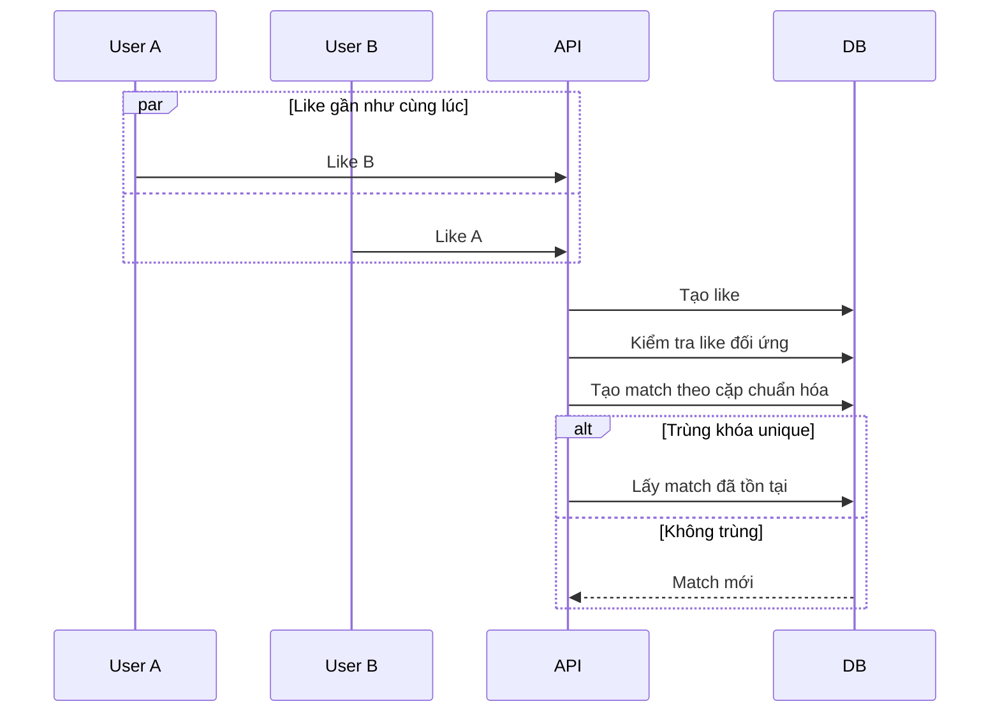

# ENHANCE.md — Bản nâng cấp MVP Dating App (viết cho người không chuyên kỹ thuật)

## 1) Hiện trạng MVP đang tốt ở điểm nào

- App đã có các chức năng chính: tạo user, bấm like, tạo match, thêm lịch rảnh, tìm lịch rảnh chung.
- Hệ thống đã có một số lớp bảo vệ cơ bản để tránh tạo dữ liệu trùng.
- Tốc độ xử lý phần tìm lịch chung đang ổn cho MVP.

---

## 2) Các lỗ hổng hiện tại (nói dễ hiểu)

### Mức rất khẩn cấp (P0)

1. **Chưa có đăng nhập/kiểm tra danh tính chuẩn**
   - Hiện tại app có thể tin dữ liệu gửi lên từ client quá nhiều.
   - Nghĩa là kẻ xấu có thể “giả làm người khác” để like, sửa lịch, hoặc xem dữ liệu không thuộc quyền.

2. **Dễ bị dò email người dùng**
   - Có luồng tìm user trực tiếp bằng email.
   - Kẻ xấu có thể thử nhiều email để biết email nào tồn tại.

3. **Chưa có giới hạn chống spam**
   - Nếu 1 người bắn quá nhiều request liên tục, hệ thống có thể chậm hoặc tốn chi phí.

### Mức cao (P1)

4. **Trả về nhiều thông tin hơn mức cần thiết**
   - Một số API trả dữ liệu khá rộng, có nguy cơ lộ thông tin riêng tư.

5. **Có thể phát sinh tình huống like chính mình**
   - Đây là case “logic sai” cần chặn rõ ràng.

6. **Kiểm tra trùng lịch chưa “khóa cứng” 100% ở DB**
   - Hiện chủ yếu dựa vào lớp app.
   - Nên khóa thêm ở database để an toàn lâu dài.

### Mức trung bình (P2)

7. **Chưa có cơ chế report/moderation hoàn chỉnh**
   - Chưa mạnh ở phần an toàn nội dung và chống quấy rối.

8. **Chưa có chuẩn log/audit đầy đủ**
   - Khi có sự cố sẽ khó truy vết đầy đủ.

---

## 3) Hướng giải quyết đề xuất (ưu tiên làm ngay)

### 3.1 Bảo mật danh tính & quyền truy cập

- Thêm đăng nhập chuẩn (JWT).
- Mọi hành động nhạy cảm phải dựa vào user đăng nhập thật, không tin hoàn toàn dữ liệu client gửi lên.
- Chỉ cho user xem/sửa dữ liệu của chính họ (trừ admin).

### 3.2 Chống dữ liệu sai/trùng ở mức database

- Chặn like chính mình.
- Chặn slot thời gian sai (giờ bắt đầu phải trước giờ kết thúc).
- Chặn trùng lịch bằng ràng buộc ở DB (không chỉ ở app).

### 3.3 Bảo vệ riêng tư API

- Hạn chế dữ liệu trả về đúng mức cần dùng trên UI.
- Không public endpoint tra email trực tiếp.
- Dùng phân trang để tránh bị quét dữ liệu hàng loạt.

### 3.4 An toàn cộng đồng cho dating app

- Thêm block/report.
- Có cơ chế unmatch/mute.
- Kiểm tra tuổi tối thiểu theo chính sách.

---

## 4) Feature mới nên làm theo giai đoạn

### Giai đoạn A (ngay sau MVP)
- Đăng nhập chuẩn.
- Block/Report.
- Thông báo match mới.
- Filter cơ bản (tuổi/giới tính).
- Phân trang danh sách swipe.

### Giai đoạn B (tăng trưởng)
- Gợi ý profile thông minh hơn.
- Giới hạn like theo ngày.
- Chat trong app + chống spam.

### Giai đoạn C (niềm tin & chất lượng)
- Xác thực profile.
- Nâng cấp moderation tự động.
- Chấm điểm rủi ro tài khoản bất thường.

---

## 5) Threat Model (phiên bản dễ hiểu)

### Tài sản cần bảo vệ
- Thông tin cá nhân (email, bio, lịch rảnh).
- Tính đúng đắn của match và lịch hẹn.

### Ai có thể tấn công
- Người spam, bot, người cố tình quấy rối, hoặc client bị chỉnh sửa.

### Các rủi ro chính
- Giả danh người khác.
- Sửa dữ liệu trái phép.
- Xem thông tin không được phép.
- Spam làm sập/chậm hệ thống.

### Cách giảm rủi ro
- Bắt buộc đăng nhập + kiểm tra quyền.
- Giới hạn tần suất request.
- Giảm dữ liệu nhạy cảm trả ra.
- Có log để truy vết bất thường.

---

## 6) Testing plan (dễ hiểu, thực dụng)

- **Unit test**: test từng hàm nhỏ (ví dụ tìm lịch chung).
- **Integration test**: test nhiều phần chạy cùng DB thật (đặc biệt race condition).
- **E2E test**: test flow như người dùng thật (đăng nhập -> like -> match -> xem lịch chung).
- **Abuse test**: test spam/rate limit/report.

---

## 7) Luật nghiệp vụ chuẩn (business rules)

1. Không được like chính mình.
2. Cùng 1 chiều like chỉ lưu 1 lần.
3. Cùng 1 cặp match chỉ có 1 bản ghi.
4. Lịch rảnh phải hợp lệ và không chồng chéo.
5. Lịch chung phải đạt thời lượng tối thiểu (vd 30 phút).
6. Nếu một bên block thì ẩn nhau và khóa tương tác.

---

## 8) Đề xuất thuật toán/kỹ thuật (giải thích cho non-tech)

### 8.1 Tìm lịch chung giữa 2 người

**Nên dùng:** kỹ thuật “hai con trỏ” (Two Pointers).

**Hiểu đơn giản:**
- Mỗi người có 1 danh sách lịch rảnh đã sắp xếp theo thời gian.
- So sánh 2 mốc hiện tại, nếu chưa khớp thì đẩy mốc kết thúc sớm hơn đi tiếp.
- Làm vậy sẽ không phải so sánh “tất cả với tất cả”.

**Vì sao nên dùng:** nhanh, dễ kiểm soát, phù hợp MVP.

### 8.2 Tránh tạo match trùng khi 2 người like cùng lúc

**Nên dùng:** chuẩn hóa cặp user + unique key ở DB + xử lý conflict an toàn.

**Vì sao nên dùng:** đảm bảo hệ thống chỉ có 1 match đúng cho 1 cặp.

### 8.3 Chống spam request

**Nên dùng:** rate limit theo cửa sổ thời gian + bucket cho burst ngắn.

**Vì sao nên dùng:**
- Người dùng bình thường vẫn dùng mượt.
- Bot/spam bị chặn sớm, giảm tải server.

### 8.4 Sắp thứ tự profile gợi ý

**Nên dùng theo lộ trình:**
1. Điểm trọng số đơn giản (dễ làm).
2. Thêm cơ chế “vừa khai thác vừa khám phá” để tránh lặp profile cùng kiểu.

**Vì sao nên dùng:** tăng tỷ lệ match dần mà không cần nhảy ngay vào AI phức tạp.

---

## 9) Observability (để vận hành ổn)

- Gắn mã request để truy vết.
- Log có cấu trúc cho các sự kiện quan trọng.
- Theo dõi các chỉ số chính: tỷ lệ match, lỗi 409, tần suất bị rate-limit, độ trễ API.

---

## 10) Next sprint đề xuất

1. Auth + kiểm tra quyền chặt.
2. Tắt public email lookup.
3. Thu gọn dữ liệu trả ra + phân trang.
4. Thêm block/report.
5. Thêm rate limiting.
6. Bổ sung test race condition + authz.

---

## 11) Tiêu chí hoàn thành “MVP Secure v1”

- Không thể thao tác dữ liệu người khác nếu không có quyền.
- Không thể dò email qua public API.
- Like đồng thời không tạo match trùng.
- Thêm lịch trùng bị chặn nhất quán.
- Có test đủ cho các luồng quan trọng.
- Có dashboard theo dõi sức khỏe hệ thống.
