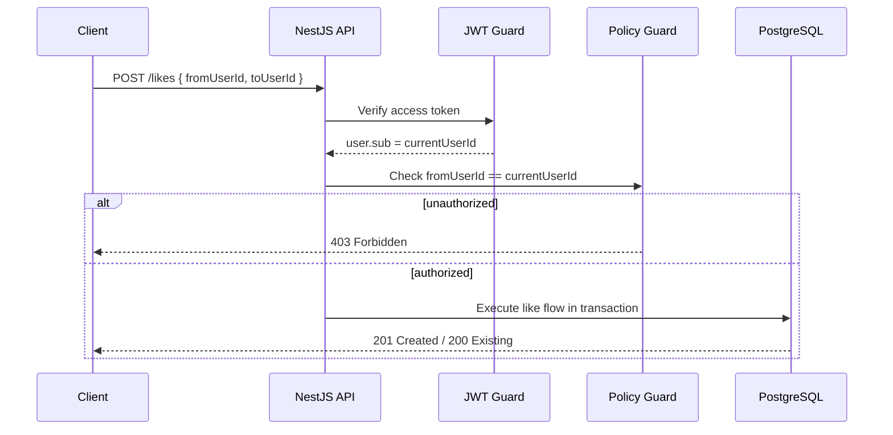
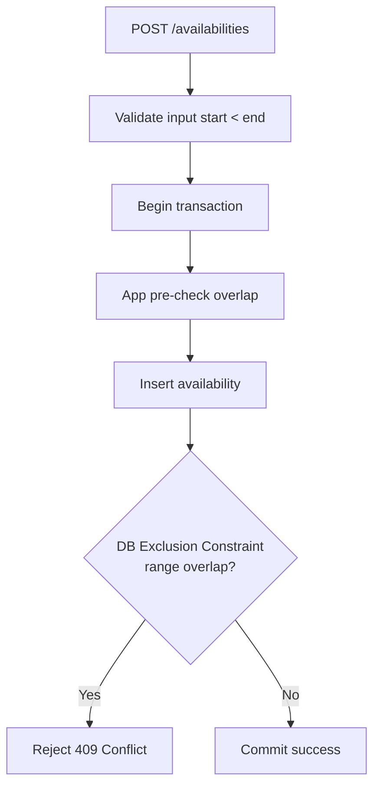
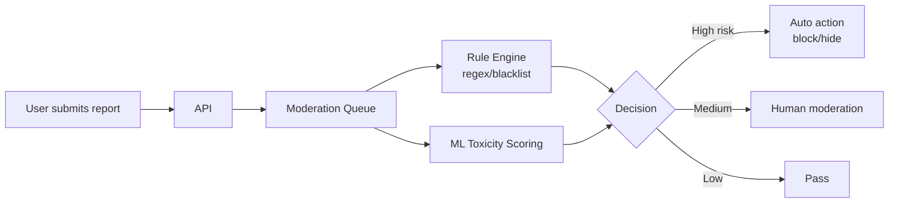
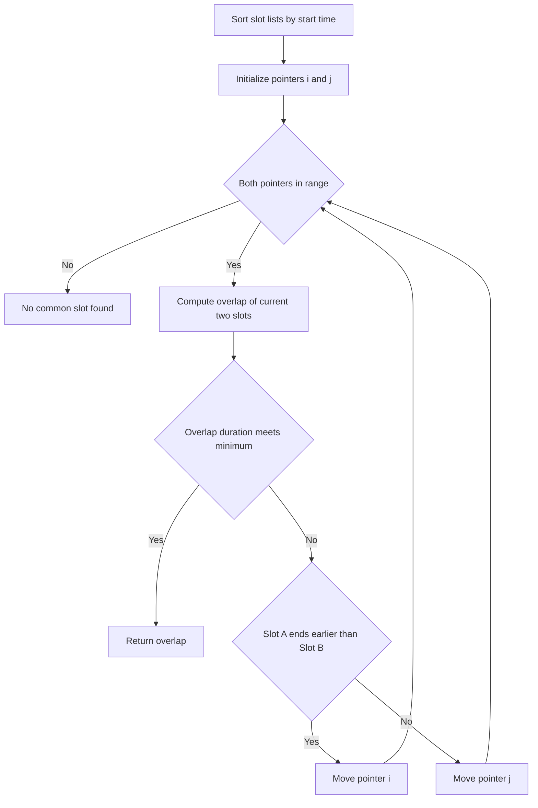
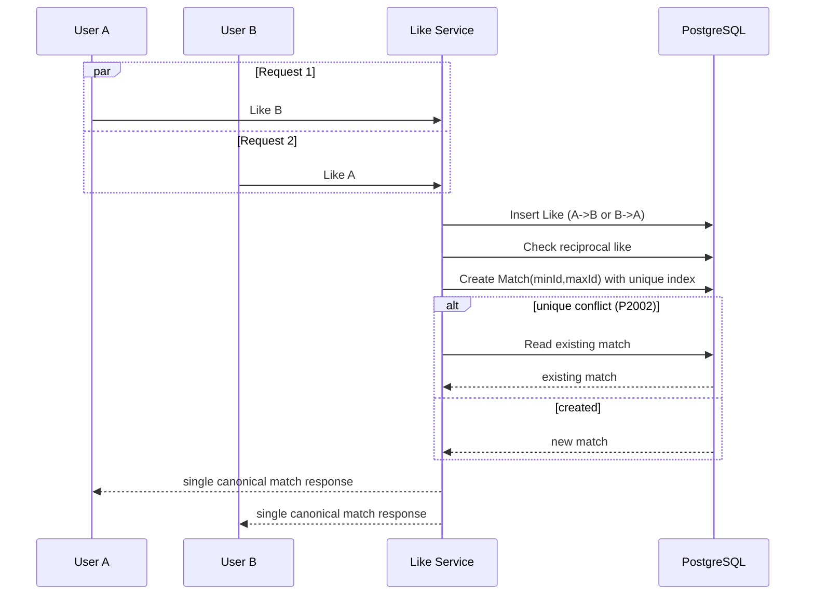

# ENHANCE.md — Dating App MVP Hardening & Roadmap

## 1) Current MVP Snapshot (what is good)

- Backend: NestJS + Prisma + PostgreSQL.
- Core flows đã có: user, like, match, availability, common-slot.
- Điểm mạnh kỹ thuật:
  - Idempotent-ish match creation qua unique constraint + catch `P2002`.
  - Overlap check cho availability trong transaction `Serializable`.
  - Common slot dùng two-pointers `O(N+M)` sau khi sort.
  - ValidationPipe global (`whitelist`, `forbidNonWhitelisted`, `transform`).

---

## 2) Current Gaps / Vulnerabilities (ưu tiên fix sớm)

## P0 (critical)

1. **No authentication / authorization**
   - Hiện API tin hoàn toàn vào `fromUserId`, `userId` từ client.
   - Bất kỳ ai cũng có thể giả mạo user khác để:
     - like hộ người khác,
     - thêm availability cho người khác,
     - đọc match/list dữ liệu của người khác.
   - Impact: account takeover logic-level, privacy breach.

2. **User enumeration & data exposure risk**
   - Có endpoint lookup theo email (`/users/email/:email`) + trả thông tin user.
   - Dễ bị scan email hợp lệ, ảnh hưởng privacy.

3. **Missing rate limiting / abuse controls**
   - Không thấy guard chống spam requests (likes brute-force, scraping user list).
   - Có thể bị abuse, tăng cost DB/API, degrade UX.

## P1 (high)

4. **PII overexposure in list endpoints**
   - `findByFromUserId` include full `toUser`; match include cả `user1`, `user2`.
   - Cần chuẩn hóa response DTO để chỉ expose fields cần thiết.

5. **Potential self-like / invalid interaction edge case**
   - Nếu DTO chưa chặn, user có thể like chính mình.
   - Nên enforce cả application + DB-level constraint.

6. **Availability consistency at DB level chưa “hard”**
   - Đang dựa app-level overlap check + Serializable.
   - Nếu sau này có job/import trực tiếp DB hoặc isolation thay đổi -> có thể lệch.

## P2 (medium)

7. **No moderation / safety pipeline**
   - Bio/name chưa có profanity/toxicity screening.

8. **No audit/security logging standard**
   - Khó forensic khi có dispute/abuse.

---

## 3) Suggested Solution Directions

## 3.1 Security & Identity (P0)

1. **Add AuthN/AuthZ baseline**
   - JWT (access token ngắn hạn) + refresh token rotation.
   - Mọi endpoint user-scoped lấy user từ token (`req.user.sub`), không nhận userId từ client cho action nhạy cảm.

2. **Object-level authorization**
   - Ví dụ:
     - `POST /likes`: `fromUserId` phải = current user.
     - `POST /availabilities`: chỉ tạo cho current user.
     - `GET /matches/user/:id`: chỉ cho phép `:id === current user` (hoặc admin).

3. **Rate limiting + bot mitigation**
   - Per-IP + per-user limits (likes/min, search/min).
   - Add device fingerprint basic + cooldown policy.

## 3.2 Data integrity & DB hardening (P1)

1. **DB constraints**
   - `Like`: check `fromUserId <> toUserId`.
   - `Availability`: check `startTime < endTime` ở DB.

2. **PostgreSQL exclusion constraint for availability overlap**
   - Dùng `tstzrange` + `EXCLUDE USING gist (user_id WITH =, time_range WITH &&)`.
   - Giảm phụ thuộc app-level race handling.

3. **Canonical pair model for Match**
   - Tiếp tục normalize `(min(userA,userB), max(...))` như hiện tại.
   - Thêm migration assert dữ liệu cũ đúng canonical order.

## 3.3 API & privacy design (P1)

1. **Response DTO minimization**
   - Tách `PublicUserProfileDto`, `PrivateUserDto`.
   - Không trả email trong public endpoints.

2. **Deprecate direct email lookup public endpoint**
   - Thay bằng internal/admin-only hoặc masked flow.

3. **Pagination + cursor-based listing**
   - Tránh scrape toàn bộ users.

## 3.4 Product safety for dating domain (P1/P2)

1. **Block/Report system**
   - `blocks` table; block phải loại khỏi swipe/match query.
   - `reports` table + moderation queue.

2. **Consent & harassment controls**
   - Unmatch, mute, restrict contact actions.

3. **Age-gating & policy checks**
   - Enforce age >= 18 at validation + backfill checks existing data.

---

## 4) New Feature Roadmap (phased)

## Phase A — Must-have after MVP (2–4 weeks)

- Auth (JWT + refresh).
- Block/Report.
- Notification v1 (new match + common slot found).
- Preferences filter (age range, gender preference).
- Pagination cho swipe candidates.

## Phase B — Growth features

- Smart recommendation scoring (distance, active hours overlap, response propensity).
- Daily like quota + “super like”.
- In-app chat (WebSocket) + anti-spam rules.

## Phase C — Trust & quality

- Profile verification (email + optional selfie check).
- Moderation ML heuristics (toxicity/spam detection).
- Risk scoring for suspicious behavior.

---

## 5) Threat Model (MVP-focused)

## Assets

- PII: email, name, age, bio, behavior graph (likes/matches), availability time slots.
- Service integrity: match correctness, schedule correctness.

## Actors

- Legit user, spammer, scraper, abusive user, compromised client.

## Main attack surfaces

- REST endpoints (`/users`, `/likes`, `/matches`, `/availabilities`).
- Public web client manipulating payload.

## Top threats (STRIDE mapping)

1. **Spoofing**: giả userId vì chưa auth.
2. **Tampering**: sửa payload để tạo like/availability cho user khác.
3. **Repudiation**: thiếu audit trail chuẩn cho hành vi nhạy cảm.
4. **Information Disclosure**: enumerate email/user data.
5. **Denial of Service**: spam likes/listing không rate limit.
6. **Elevation of Privilege**: truy cập data object-level không thuộc quyền.

## Mitigations

- JWT + guards + policy checks.
- Rate-limit + WAF/CDN basic rules.
- Structured audit logs + immutable event stream cho actions quan trọng.
- Minimized DTO + masking.
- Alerting on anomaly metrics.

---

## 6) Testing Strategy (pragmatic)

## 6.1 Unit tests

- `findFirstCommonSlot`:
  - overlap/no overlap,
  - boundary cases (touching endpoints),
  - timezone-normalized inputs.
- Like/Match service:
  - duplicate likes,
  - mutual like creates single match,
  - concurrent path handles `P2002`.

## 6.2 Integration tests (DB real)

- Transaction race tests:
  - 2 request like đồng thời 2 chiều -> đúng 1 match.
  - concurrent availability inserts overlap -> 1 success, 1 conflict.
- Authorization tests (sau khi thêm auth):
  - cannot act on another user’s resources.

## 6.3 E2E tests

- Happy flows:
  - signup/login -> swipe -> mutual like -> common-slot.
- Abuse flows:
  - spam like rate-limited,
  - blocked user disappears from candidates.

## 6.4 Non-functional tests

- Load test cho swipe/list endpoints.
- Basic security tests: IDOR, auth bypass, injection checks.

---

## 7) Logic & Domain Rules (recommended canonical set)

1. User cannot like self.
2. Single directed like per pair (`from`,`to`) unique.
3. Single match per undirected pair canonicalized.
4. Availability slot must satisfy `start < end` and non-overlap per user.
5. Common-slot minimum duration threshold (e.g., 30 phút) configurable.
6. Block precedence: if either side blocks, hide profile + disable interaction.
7. Soft delete/anonymization policy for privacy compliance.

---

## 8) Observability & Ops

- Add request ID correlation (`x-request-id`).
- Structured logs (JSON) for auth/like/match/availability events.
- Metrics:
  - likes/day, mutual-like rate,
  - match creation latency,
  - conflict rate (`409`) for availability,
  - abuse/rate-limit hits.
- Error budget + alerts (5xx spike, DB latency, queue lag).

---

## 9) Practical Next Sprint Plan

1. Implement Auth + Guard + object-level policy checks.
2. Remove/de-scope public email lookup endpoint.
3. Add DTO minimization and pagination.
4. Add block/report schema + APIs.
5. Add rate limiting on sensitive endpoints.
6. Expand integration tests for concurrency + authz.

---

## 10) Algorithm / Technique Proposals by Problem

## 10.1 Swipe candidate ranking

**Problem**: Chọn thứ tự profile để tăng tỉ lệ like/match, nhưng vẫn đa dạng.

**Đề xuất**:
1. **Weighted scoring (baseline)**
   - Điểm = tổng trọng số các feature: age preference fit, gender preference fit, availability overlap score, recency/activity score, distance bucket.
2. **Multi-armed bandit (epsilon-greedy hoặc UCB) cho explore/exploit**
   - 80–90% show profile top score (exploit), 10–20% random có kiểm soát (explore).

**Vì sao nên dùng**:
- Weighted scoring dễ implement, dễ debug, phù hợp MVP.
- Bandit giúp tránh “kẹt local optimum”, liên tục học sở thích user mà không cần ML pipeline nặng.

**Độ phức tạp**:
- Scoring online: O(K) mỗi candidate (K = số feature), thường nhỏ.

## 10.2 Common-slot computation

**Problem**: Tìm khung thời gian giao nhau đầu tiên (hoặc tốt nhất) giữa 2 users.

**Đề xuất**:
1. **Two pointers trên 2 list đã sort** (đang dùng) cho first feasible slot.
2. **Sweep-line / merge intervals** khi mở rộng sang nhiều rule (buffer time, priority windows).

**Vì sao nên dùng**:
- Two pointers tối ưu cho 2 người, dữ liệu dạng interval, cực nhanh O(N+M).
- Sweep-line linh hoạt hơn khi cần scoring nhiều khoảng giao nhau.

**Độ phức tạp**:
- Two pointers: O(N+M) sau sort.
- Sweep-line: O((N+M) log(N+M)) nếu cần sort events tổng.

## 10.3 Availability overlap prevention

**Problem**: Chặn insert slot bị overlap trong môi trường concurrent.

**Đề xuất**:
1. **DB-level exclusion constraint (`tstzrange` + GiST)**.
2. Giữ app-level pre-check để trả lỗi thân thiện trước.

**Vì sao nên dùng**:
- Constraint ở DB là “single source of truth”, chặn race condition chắc chắn hơn app logic.
- Không phụ thuộc isolation level hay code path khác (import scripts, admin jobs).

## 10.4 Mutual-like idempotency

**Problem**: 2 request đồng thời có thể tạo match trùng.

**Đề xuất**:
1. **Canonical pair + unique index + upsert/catch-conflict** (đang làm tốt).
2. Tùy scale: **idempotency key** cho client retries.

**Vì sao nên dùng**:
- Unique index xử lý đúng tại tầng dữ liệu, chống duplicate tuyệt đối.
- Idempotency key giảm side effects khi mobile/web retry do network fail.

## 10.5 Feed/query efficiency (users/matches)

**Problem**: Danh sách tăng dần gây chậm, pagination offset dễ tốn cost.

**Đề xuất**:
1. **Cursor-based pagination** theo `(createdAt, id)`.
2. Index phù hợp query chính (ví dụ createdAt desc, composite khi filter).

**Vì sao nên dùng**:
- Cursor ổn định hơn offset khi dữ liệu thay đổi liên tục.
- Tránh scan/skip nhiều rows ở trang sâu.

## 10.6 Abuse detection (spam likes/report)

**Problem**: Spam/bot làm giảm chất lượng hệ thống.

**Đề xuất**:
1. **Sliding window rate limiting** (Redis).
2. **Token bucket** cho burst ngắn có kiểm soát.
3. **Rule-based anomaly score** ban đầu (likes/min, unique targets/hour, report ratio).

**Vì sao nên dùng**:
- Sliding window công bằng theo thời gian thực hơn fixed window.
- Token bucket cân bằng UX (cho phép burst nhỏ) và protection.
- Rule-based triển khai nhanh, chưa cần ML.

## 10.7 Moderation text (bio/name)

**Problem**: Nội dung toxic/spam/sexual harassment.

**Đề xuất**:
1. **Layered moderation**:
   - blacklist/regex nhanh,
   - model scoring (toxicity/profanity) async.
2. **Queue + async moderation pipeline** cho scale.

**Vì sao nên dùng**:
- Layer 1 chặn tức thì low-cost.
- Layer 2 nâng precision/recall, giảm false positive lâu dài.

## 10.8 Recommendation evolution path

**Problem**: Cần nâng dần từ heuristic sang learned ranking.

**Đề xuất lộ trình**:
1. Heuristic weighted score.
2. Logistic regression/GBDT (learning-to-rank đơn giản) từ event logs.
3. Contextual bandit cho personalization online.

**Vì sao nên dùng**:
- Đi từ đơn giản -> hiệu quả, không over-engineer sớm.
- Mỗi bước đều đo được uplift (CTR like, mutual-like rate, conversion to chat/date).

---

## 11) Acceptance Criteria for “MVP Secure v1”

- Không endpoint nào cho phép thao tác resource user khác khi không quyền.
- Không thể enumerate user qua email public API.
- Concurrent mutual-like luôn tạo tối đa 1 match.
- Concurrent overlap availability luôn reject đúng.
- Critical flows có test coverage integration/e2e tối thiểu đã define.
- Có dashboard metric + alert baseline.
