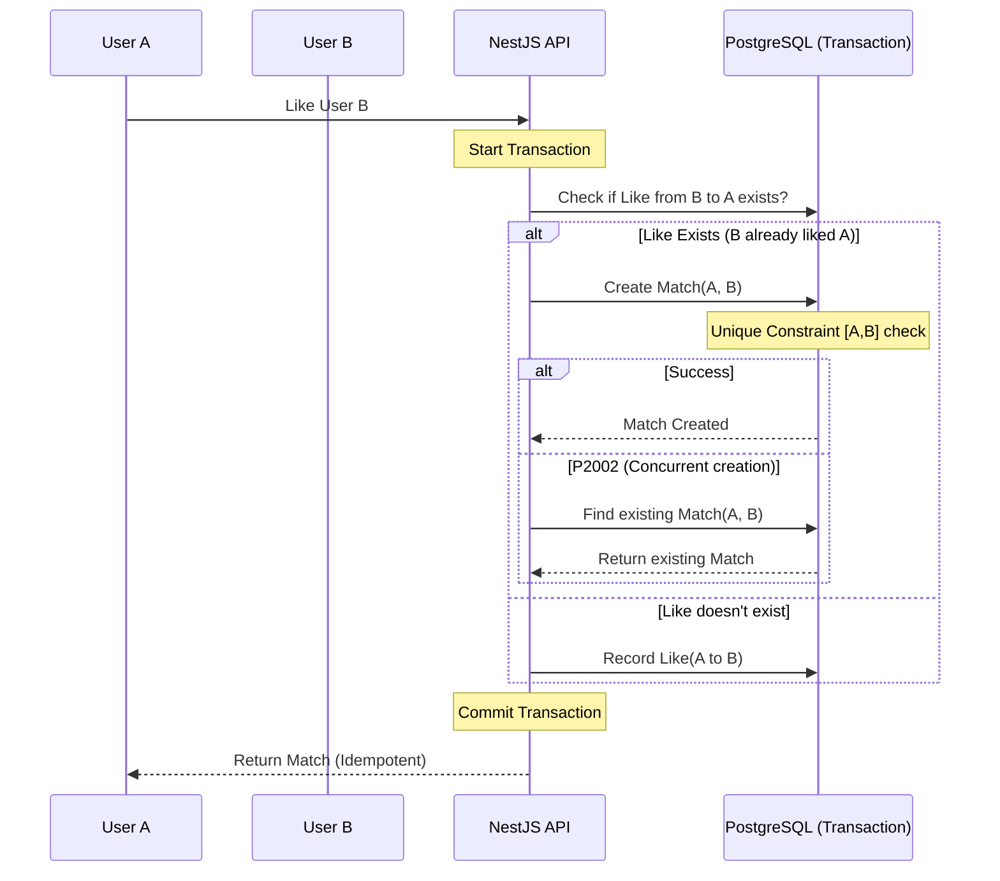

# 🍌 Cà Chớn Dating — MVP 🚀

Chào mừng bạn đến với **Cà Chớn Dating**, ứng dụng hẹn hò dành riêng cho những bồ tèo bận rộn. Đây không chỉ là một ứng dụng "quẹt phải" đơn thuần, mà là một giải pháp tối ưu hóa lịch trình để hai người có thể thực sự gặp nhau ngoài đời.

🔗 **Live Version:** [https://dating-app-mvp-frontend.vercel.app/swipe](https://dating-app-mvp-frontend.vercel.app/swipe)

---

## Hướng dẫn Review (How to Test)

Để trải nghiệm trọn vẹn logic của hệ thống mà không mất thời gian tạo dữ liệu, vui lòng thực hiện theo các bước sau:

### 1. "Nhập vai" Văn Tèo
- Tại giao diện, bấm vào nút **"CÀ CHỚN IDENTITY"** (góc dưới bên phải).
- Chọn tài khoản **Văn Tèo** (`teo@ex.com`). Đây là nhân vật chính của chúng ta.

### 2. Quẹt và Test Scenario
Hãy lướt (Swipe) cho đến khi bạn gặp các "Persona" sau để thấy cách Backend xử lý logic:

| Persona | Scenario | Technical handling |
| :--- | :--- | :--- |
| **Thằng ảo A (Overlap)** | Hai bên cùng "Like" nhau + Có thời gian rảnh trùng nhau. | **Match thành công**. Khi vào trang chi tiết Match, hệ thống sẽ tự động dùng thuật toán Two Pointers để tìm thấy lịch chung (Ví dụ: 9h-11h sáng mai). |
| **Thằng ảo B (Lệch Pha)** | Hai bên cùng "Like" nhau + **KHÔNG** có thời gian rảnh trùng nhau. | **Match thành công**, nhưng khi vào xem lịch chung sẽ thấy thông báo "Chưa tìm thấy lịch chung". Điều này chứng minh thuật toán kiểm tra tính giao nhau cực kỳ chính xác. |
| **Thằng ảo C (Đa Tình)** | Một người có rất nhiều slot rảnh rải rác. | Chứng minh hiệu năng của thuật toán $O(N+M)$ khi phải quét qua danh sách lịch trình phức tạp. |

> [!TIP]
> **Test Race Condition:** Bạn có thể thử bấm "Like" thật nhanh liên tục hoặc mở 2 tab cùng Like một người. Backend sẽ chặn đứng bằng Idempotent Logic (Prisma Transaction + Unique Constraint) để không bao giờ tạo ra Match trùng lặp.

---

## 🛠️ Tech Stack
- **Frontend**: Next.js 15 (App Router), TailwindCSS, Zustand (State Management), Lucide React.
- **Backend**: NestJS (Node.js), Prisma ORM.
- **Database**: PostgreSQL (Supabase).
- **Deployment**: Vercel (Web) & Render (API).

---

## 🧠 Technical Deep Dive — Backend Excellence

Dự án này được thiết kế với tư duy tập trung vào **hiệu năng (Efficiency)** và **tính toàn vẹn dữ liệu (Data Integrity)**. Dưới đây là những quyết định kỹ thuật tiêu biểu:

### 1. Thuật toán Tìm Lịch Chung: $O(N + M)$ vs $O(N \times M)$
Thay vì dùng 2 vòng lặp lồng nhau (Nested Loops) để so sánh từng cặp slot của hai người dùng, tôi sử dụng kỹ thuật **Two Pointers (Hai con trỏ)** trên tập dữ liệu đã được sắp xếp.

**Logic Proof (Pseudo Code):**
```typescript
// Sắp xếp mảng A và B theo thời gian bắt đầu
Sort(slotsA); Sort(slotsB);

let i = 0, j = 0;
while (i < slotsA.length && j < slotsB.length) {
    // Tìm phần giao nhau giữa slotsA[i] và slotsB[j]
    const overlap = FindIntersection(slotsA[i], slotsB[j]);
    
    if (overlap.duration >= 30min) return overlap;

    // Con trỏ nào kết thúc sớm hơn thì nhích con trỏ đó lên
    if (slotsA[i].endTime < slotsB[j].endTime) i++;
    else j++;
}
```
- **Độ phức tạp**: $O(N \log N + M \log M)$ cho việc sắp xếp và $O(N + M)$ cho việc tìm kiếm.
- **Ưu điểm**: Cực kỳ nhanh kể cả khi người dùng có hàng trăm slot rảnh trong tháng.

### 2. Xử lý Race Condition (Mutual Like Idempotency)
Trong thực tế, hai người có thể "Like" nhau cùng một lúc. Nếu không xử lý khéo, hệ thống có thể tạo ra 2 bản ghi Match trùng lặp hoặc crash.

**Sơ đồ luồng xử lý (Mermaid):**



**Giải pháp**:
- Sử dụng `prisma.$transaction` để đảm bảo tính nguyên tử (Atomicity).
- Thiết lập `@@unique([user1Id, user2Id])` ở mức Database.
- **Idempotency**: Catch lỗi `P2002` (Unique Constraint Violation). Nếu xảy ra xung đột, hệ thống sẽ tự động trả về Match hiện có thay vì báo lỗi. App vẫn "sống nhăn răng" kể cả khi nhận 100 request trùng lặp.

### 3. Race Condition trong Availability (Serializable Isolation)
Ở tầng ứng dụng, tôi sử dụng `IsolationLevel.Serializable` trong Prisma Transaction để kiểm tra Overlap khi người dùng thêm lịch rảnh.

**Insights & Trade-offs**:
- **Hiện tại**: Đã an toàn trước các request gửi sát nút nhau nhờ mức cô lập cao nhất của DB.
- **Production-ready Idea**: Để tối ưu hơn nữa và tránh khóa (lock) DB quá lâu, có thể sử dụng `EXCLUDE USING gist` constraint của PostgreSQL. Điều này chuyển việc kiểm tra logic overlap từ Application Layer xuống thẳng Database Engine.

---

## 🏗️ Kiến trúc & Design Decisions

### 🎨 Neo-Brutalism Design
Giao diện không đi theo lối mòn "bo góc tròn trịa". Tôi chọn phong cách **Neo-Brutalism**: màu sắc tương phản mạnh (Banana Yellow), viền đen dày (2px), đổ bóng khối (4px). Nó tạo cảm giác mạnh mẽ, sòng phẳng — đúng tinh thần "Cà Chớn".

### 📦 State Management (Zustand)
Sử dụng Zustand với middleware `persist` để lưu trữ thông tin "Persona" giả lập (Văn Tèo). Điều này giúp nhà tuyển dụng có thể trải nghiệm toàn bộ flow mà không cần hệ thống Auth phức tạp (vốn không cần thiết cho một bản MVP về logic).

---

## 🚧 Tech Debt & Future Works
- **Auth**: Hiện tại dùng Email-based Identity Switcher để demo nhanh. Production sẽ cần JWT/OAuth2.
- **Micro-animations**: Cần thêm Framer Motion để các tương tác "Match" trở nên bùng nổ hơn.
- **Validation**: Đã sử dụng `ValidationPipe({ transform: true })`. Một bước tiến "Pro" hơn sẽ là dùng `@Type(() => Date)` trong DTO để NestJS tự parse đối tượng Date thay vì dùng `new Date()` thủ công trong Service.

---

**Cà Chớn Dating** — Hẹn hò là phải gặp, mà gặp là phải rảnh! 🍌☕🚀
